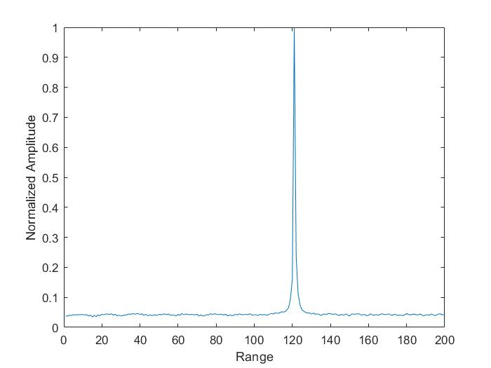
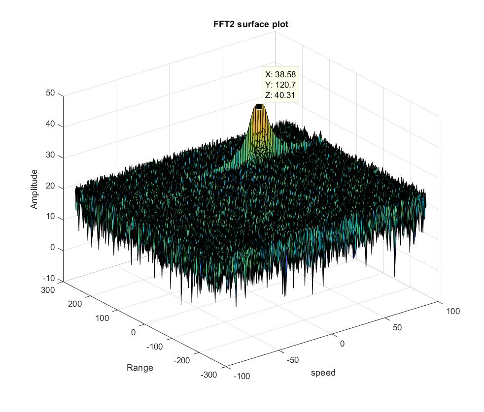
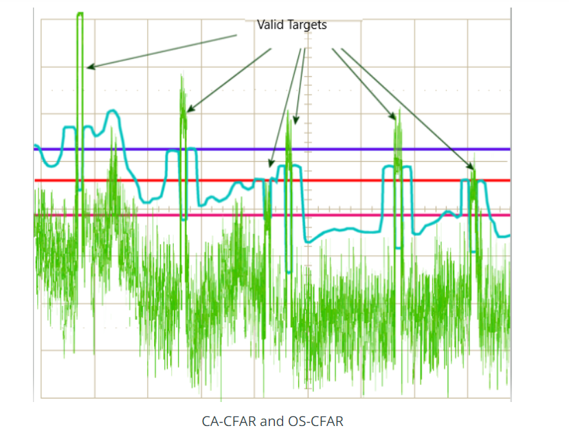
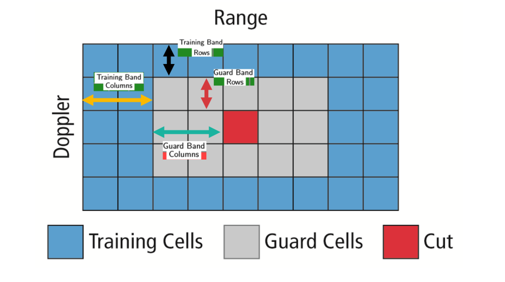
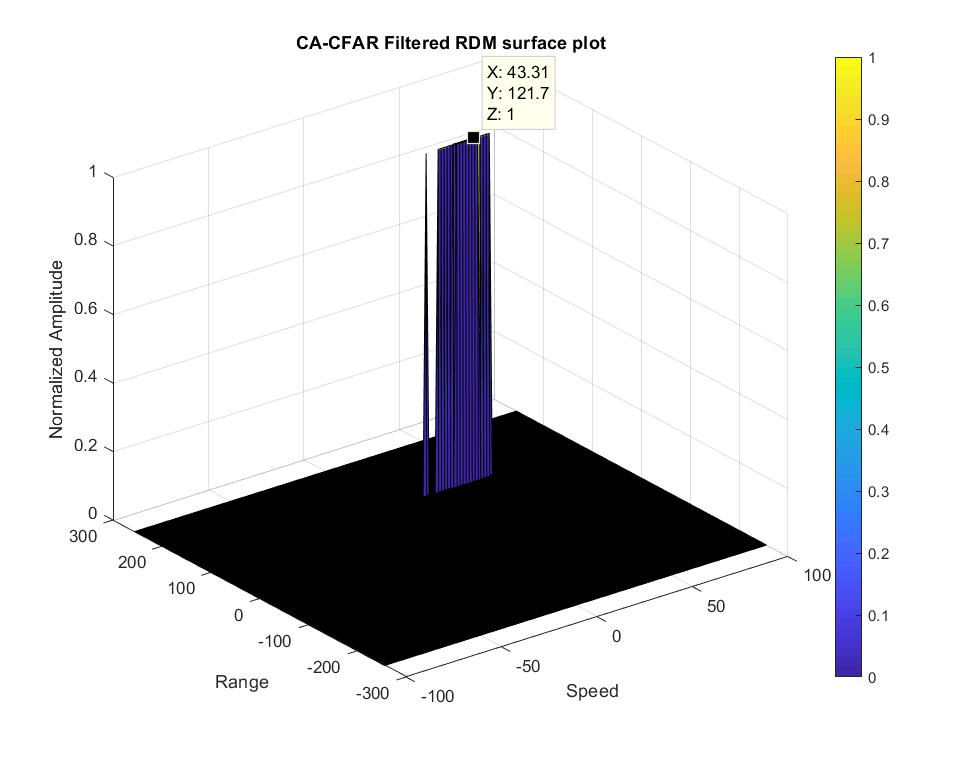
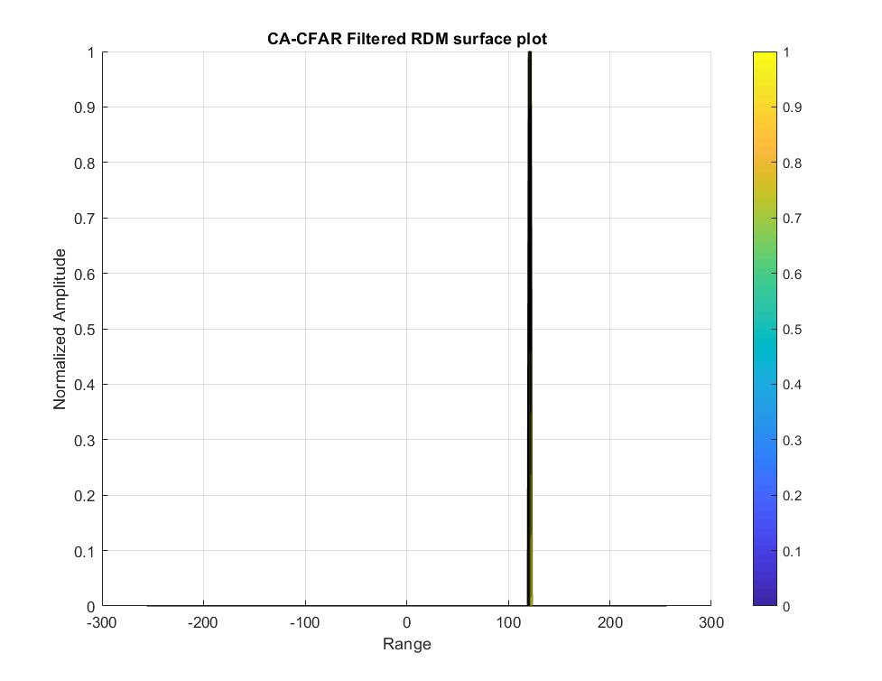
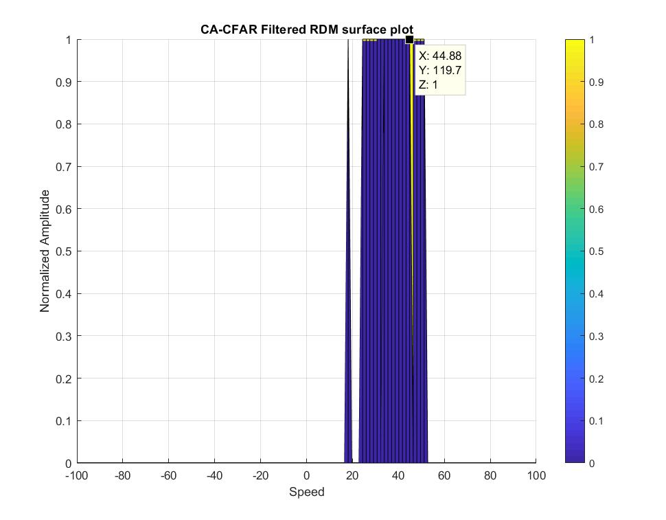

# Radar Target Generation and Detection in MATLAB

## Radar Setup :

```
%% Radar Specifications 
%%%%%%%%%%%%%%%%%%%%%%%%%%%
% Frequency of operation = 77GHz

% Range Resolution = 1 m

% Max Velocity = 100 m/s

%%%%%%%%%%%%%%%%%%%%%%%%%%%

Range_res = 1;
Light_speed = 3e8;
Max_range = 200;
Max_velocity = 100;

```

## Taget Info:
 ```
 %max range of target is 200m
 % min/max velocity is -70 to 70 m/s

 Range_target = 120;
 Velocity_target = 40;

 ```


## Frequency Modulated Continous Wave (FMCW)
```
%Operating carrier frequency of Radar 
fc= 77e9;            

% Bandwith of the chirp signal

B_sweep = Light_speed/(2*Range_res);

% Chirp signal sweep time

T_c = 5.5*2*Max_range/Light_speed;

% The slope of the upramp chirp
slope = B_sweep/T_c;
                                                          
%The number of chirps in one sequence. Its ideal to have 2^ value for the ease of running the FFT
%for Doppler Estimation. 

Nd=128;                   % #of doppler cells OR #of sent periods

% number of chirps

%The number of samples on each chirp. 

Nr=1024;                  %for length of time OR # of range cells

```

## FFT (1D for the range detection):
* Implement the 1D FFT on the Mixed Signal (Computed from the transimit signal and received signal, from code #line 73 ~ 92)
* Reshape the vector into Nr*Nd array.
* Run the FFT on the beat signal along the range bins dimension (Nr)
* Normalize the FFT output.
* Take the absolute value of that output.
* Keep one half of the signal
* Plot the output
* There should be a peak at the initial position of the target



From the plot, the target is 120 meter away from the radar, it is exactly the same to target range in the setup

## FFT(2D for the range and velocity detection):
```
sig_fft2 = fft2(Mix,Nr,Nd);
sig_fft2 = sig_fft2(1:Nr/2,1:Nd);
sig_fft2 = fftshift (sig_fft2);
```
 

 * x represents the speed (~39m/s) is close to the target speed (40 m/s)
 * y represents the range (~120 m) is close to the target range (120 m)

 ## 2d Constant Flase Alarm Rate(2D-CFAR)

 

 The false alarm issue can be resolved by implementing the constant false alarm rate. CFAR varies the detection threshold based on the vehicle surroundings. The CFAR technique estimates the level of interference in radar range and doppler cells “Training Cells” on either or both the side of the “Cell Under Test”. The estimate is then used to decide if the target is in the Cell Under Test (CUT).

The process loops across all the range cells and decides the presence of target based on the noise estimate.The basis of the process is that when noise is present, the cells around the cell of interest will contain a good estimate of the noise, i.e. it assumes that the noise or interference is spatially or temporarily homogeneous. Theoretically it will produce a constant false alarm rate, which is independent of the noise or clutter level



* Determine the number of Training cells for each dimension Tr and Td. Similarly, pick the number of guard cells Gr and Gd.
* Slide the Cell Under Test (CUT) across the complete cell matrix
* Select the grid that includes the training, guard and test cells. Grid Size = (2Tr+2Gr+1)(2Td+2Gd+1).
* The total number of cells in the guard region and cell under test. (2Gr+1)(2Gd+1).    
* This gives the Training Cells : (2Tr+2Gr+1)(2Td+2Gd+1) - (2Gr+1)(2Gd+1)
* Measure and average the noise across all the training cells. This gives the threshold
* Add the offset (if in signal strength in dB) to the threshold to keep the false alarm to the minimum.
* Determine the signal level at the Cell Under Test.
* if the CUT signal level is greater than the Threshold, assign a value of 1, else equate it to zero.
* Since the cell under test are not located at the edges, due to the training cells occupying the edges, we suppress the edges to zero. Any cell value that is neither 1 nor a 0, assign it a zero.

```

 for i = Tr+Gr+1:(Nr/2-Tr-Gr)
        for j = Tc+Gc+1:(Nd-Tc-Gc)
            noise_level = zeros(1,1);
            for k = (i-Tr-Gr) : (i+Tr+Gr)
                for h = (j-Tc-Gc) : (j+Gc+Tc)
                    if(abs(k-i)>Gr||abs(h-j)>Gc)
                        noise_level = noise_level + db2pow(RDM(k,h));
                    end
                end
            end
            length = 2*(Tr+Gr)+1;
            width =  2*(Tc+Gc)+1;
            threshold = pow2db(noise_level/(length*width-(2*Gr+1)*(2*Gc+1)))*1.4;
            if(RDM(i,j)>threshold)
                CUT(i,j) = 1;
            else
                CUT(i,j) = 0;
            end
        end
    end

```

### output




